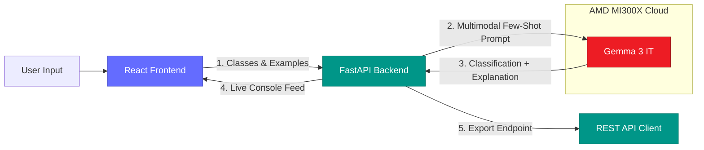

# Classifi

```text
 ██████╗██╗      █████╗ ███████╗███████╗██╗███████╗██╗
██╔════╝██║     ██╔══██╗██╔════╝██╔════╝██║██╔════╝██║
██║     ██║     ███████║███████╗███████╗██║█████╗  ██║
██║     ██║     ██╔══██║╚════██║╚════██║██║██╔══╝  ██║
╚██████╗███████╗██║  ██║███████║███████║██║██║     ██║
 ╚═════╝╚══════╝╚═╝  ╚═╝╚══════╝╚══════╝╚═╝╚═╝     ╚═╝
```

No-code AI classifier via few-shot LLM inference. Define 2+ categories, label ~5–10 examples each, get a working text or image classifier — with a natural-language explanation for every prediction. No training step, ever.

[Live Demo Deployment](https://github.com/aynaakhann/Classifi)


Classifi sits at the intersection of zero-shot visual/text understanding and few-shot in-context learning, allowing non-technical users to build and deploy high-performance classifiers in minutes.

This is a **hackathon project built for the AMD Developer Hackathon: ACT II** (lablab.ai, July 6–11 2026), Track 3 "Unicorn."

## Team

**Team Name:** Vizminds V2

| Member | Role |
| --- | --- |
| Ayna Khan | Team Lead |
| Syuja Dewa | Team Member |
| Abdullah | Team Member |

## Problem Statement

Building a custom AI classifier (e.g., "is this support ticket urgent," "is this X-ray note normal," "is this part defective") usually means collecting hundreds of labeled examples and either training a model or hiring an ML engineer. That cost is fine for a company with an ML team and a data pipeline, but not for a teacher grading essays, a clinic triaging intake notes, a QA line spotting defective parts, a researcher coding survey responses, or an NGO field team sorting reports.

The gap isn't "can an LLM classify text/images" — it obviously can. It's "can a non-technical person go from zero to a working, explainable, shareable classifier in minutes, without labeling hundreds of examples or touching a training pipeline."

## Hackathon Pitch

**Classifi lets anyone build and deploy a text or image classifier in under 5 minutes with just 5 examples.**

Instead of launching a multi-hour model training job, Classifi leverages the few-shot visual and language capability of Gemma 3. Labeled examples become in-context exemplars in a prompt, and the model classifies new inputs while giving a natural-language explanation of its reasoning.

The one-line pitch:
```text
Classifi makes custom AI classification instant, explainable, and production-ready with zero training.
```

## Our Solution

Classifi combines an intuitive web dashboard, a fast few-shot inference API, and self-hosted Gemma 3 acceleration on AMD MI300X.

The system provides:
- **Zero Training, Full Stop:** No training queue or fine-tuning runs. Your classifier exists the instant you define your classes and examples.
- **Multimodal by Design:** Handle text and image classification through the same pipeline using a single model.
- **Natural-Language Explainability:** Every prediction returns a clear, plain-English reason for the classification.
- **One-Click REST API Export:** Export any classifier as a stable endpoint that other applications can query instantly.
- **AMD MI300X Acceleration:** Runs self-hosted inference on AMD hardware via vLLM and ROCm with live performance metrics.

## How It Works

1. **Define classes:** The user names 2+ categories (e.g., "urgent" vs. "normal").
2. **Label examples:** Drag-and-drop ~5–10 example texts or images per class.
3. **Few-shot prompt built automatically:** The FastAPI backend assembles the labeled examples into a structured prompt.
4. **Classify:** The prompt plus a new input is sent to Gemma 3. The model returns the predicted label, a confidence score, and a one-sentence reason.
5. **Test live:** The user pastes or uploads a fresh input and watches the classifier work in real time.
6. **Export as REST API:** Generate a stable endpoint to integrate the classifier into third-party apps.

## Tech Stack

| Layer | Technology |
| --- | --- |
| Frontend | React, TypeScript, Vite |
| UI styling | Tailwind CSS, Shadcn theme |
| Backend | Python, FastAPI, Pydantic, Uvicorn |
| Inference Engine | Gemma 3 (12B/27B) |
| Compute Platform | AMD MI300X (via AMD Developer Cloud) |
| Runtime Environment | vLLM, ROCm, Docker |

## Architecture



## Differentiation

Any judge who has seen a no-code classifier before will think of Nyckel, Teachable Machine, or Lobe. Classifi differentiates against these head-on:

| Feature | **Classifi** | Nyckel | Teachable Machine | Lobe |
|---|---|---|---|---|
| **Method** | Few-shot LLM prompting — **zero training step** | Trains a small model per classifier ("seconds") | Trains an on-device model (transfer learning) | Trains a local image model (transfer learning) |
| **Modality** | **One model, text AND image** | Text + image | Image / audio / pose — no text | Image only |
| **Explanation** | **Yes — natural-language reason with every result** | No | No | No |
| **License** | **Open-source MIT, self-hostable** | Closed SaaS | Closed | Closed |
| **API Export** | Per-classifier REST endpoint | Yes | Edge export only | Edge export only |

## Repository Structure

```text
Classifi/
|-- backend/      FastAPI app, few-shot prompt builder, prediction endpoints, GPU metrics API
|-- frontend/     React/Vite application for class definition, labeling, and live testing
|-- deploy/       Inference deployment configuration (vLLM, Docker, AMD ROCm templates)
|-- docs/         Detailed specifications, guides, and comparison studies
```

## Local Setup

### 1. Python Environment (Backend)

Navigate to the `backend/` directory:

```bash
cd backend
python -m venv .venv
source .venv/bin/activate
pip install -r requirements.txt
```

### 2. Backend Environment Config

Create your `.env` file from the example:

```bash
cp .env.example .env
```

Add your `FIREWORKS_API_KEY` (or configure your self-hosted vLLM endpoint URL):

```text
FIREWORKS_API_KEY=your-api-key
FIREWORKS_MODEL=accounts/fireworks/models/gemma-3-12b-it
ENGINE_LABEL=amd-self-hosted
```

### 3. Start the Backend

```bash
uvicorn app.main:app --reload
```

The API will be available at `http://localhost:8000`. You can inspect the interactive OpenAPI documentation at `http://localhost:8000/docs`.

### 4. Start the Frontend

Navigate to the `frontend/` directory in a new terminal window:

```bash
cd frontend
npm install
npm run dev
```

The application will be running locally at `http://localhost:5173`.

## Demo Test Scenarios

### Scenario 1: Text Spam Classification
- **Classes:** `Spam`, `Inbox`
- **Examples:**
  - `Spam`: "Buy cheap medications now! Special discount codes inside!"
  - `Spam`: "Congratulations, you won a free vacation to Hawaii! Click this link."
  - `Inbox`: "Hey, are we still meeting up for coffee at 3:00 PM today?"
  - `Inbox`: "Please review the attached invoice for project milestones."
- **Input:** "Urgent: unclaimed funds detected. Verify your bank account immediately."
- **Expected Outcome:** Classified as `Spam` with a natural-language reason highlighting urgency and bank verification requests.

### Scenario 2: Image Classification (Pets)
- **Classes:** `Cat`, `Dog`
- **Examples:** Drag and drop 5 cat pictures and 5 dog pictures.
- **Input:** A new, unseen photo of a puppy.
- **Expected Outcome:** Classified as `Dog` with an explanation referencing canine features (ears, snout, coat structure).

## License

MIT — see [LICENSE](LICENSE).
